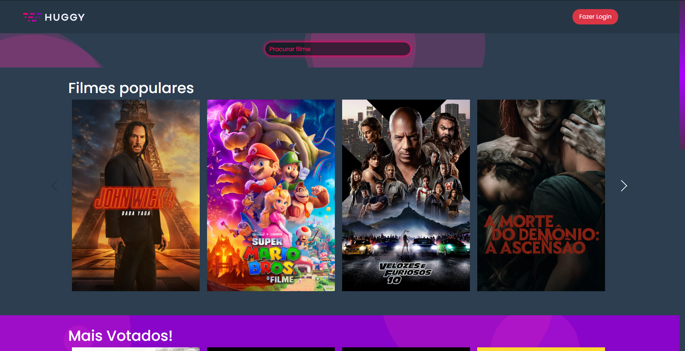
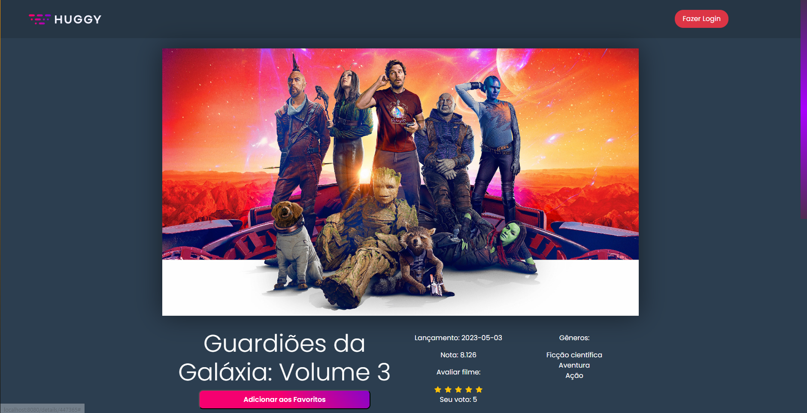

## Huggy Movies

<p>
Este é um repositório para o projeto Huggy Movies, que consiste no desenvolvimento de uma micro-aplicação web para a busca, exibição de detalhes, sugestão e avaliação de filmes, utilizando um banco de dados importado da API TMDB (The Movie Databank);

<p align="center">
  <a href="#-tecnologias">Tecnologias</a>&nbsp;&nbsp;&nbsp;|&nbsp;&nbsp;&nbsp;
  <a href="#-Instalando">Instalando</a>&nbsp;&nbsp;&nbsp;|&nbsp;&nbsp;&nbsp;
  <a href="#-Funcionalidades">Funcionalidades</a>&nbsp;&nbsp;&nbsp;|&nbsp;&nbsp;&nbsp;
  <a href="#-Estruturação">Estruturação</a>&nbsp;&nbsp;&nbsp;|&nbsp;&nbsp;&nbsp;
  <a href="#-Deploy">Deploy</a>


<br>

<p align="center">
  
  

</p>

## Tecnologias

O projeto foi desenvolvido com as seguintes tecnologias:

- HTML
- CSS
- JavaScript
- VueJS
- Bootstrap 4
- TMDB API


## Instalando

``` bash
1.  Clone o repositório em sua máquina local.
2.  Instale as dependências usando o gerenciador de pacotes (npm install).
3.  Execute o comando `npm run dev` para iniciar o servidor de desenvolvimento.
4.  Abra o navegador e acesse `http://localhost:8080`.
```
```bash
É possível que seja necessária a atualização da API KEY para requisitar os dados da API, caso
aconteça, atualize-a utilizando sua chave (que você encontra sua chave nas configurações da sua
conta na plataforma da TMDB) no arquivo localizado em (./src/services/api.js), na linha 8, onde se
encontra "Authorization".
```

## Funcionalidades


Este projeto tem como objetivo uma micro-aplicação web para busca, exibição de detalhes, sugestão e avaliação de filmes, sendo necessára integração com a API da plataforma [The Movie DB](https://www.themoviedb.org). A aplicação conta com as seguintes funcionalidades:


- Tela inicial com carrossel de sugestão de filmes, filmes mais votados e filmes favoritados pelo usuário (✔)
- Tela de login e recuperação de senha (fake, conforme solicitado) (✔)
- Tela de visualização dos detalhes do título escolhido e filmes similares ao mesmo (✔)
- Avaliação do filme de 0 a 5 estrelas, salvando o dado em LocalStorage (✔)
- Adicionar um filme aos favoritos (✔)

## Estruturação

O projeto foi estruturado da seguinte forma:

- `components`: Contém todos os componentes Vue que são usados para construir a página.<br>
- `services`: Contém o arquivo `api.js`, o qual armazena a variavel api, para faciliar a conexão e requisição de informações da API.<br>
- `store`: Contém o funcionamento do Vuex, o qual armazena o estado da aplicação.<br>
- `views`: Contém as páginas do aplicativo. O arquivo `Home.vue` é a página principal, a qual contém os componentes principais. Já o arquivo `MovieDetails.vue`, como o próprio nome diz por si só, é a renderização dos detalhes do filme escolhido.
<br>

## Deploy

O projeto foi hospedado na vercel, [clique aqui para visitar](https://vue-and-tmdb.vercel.app).<br>

 ```
 Note que o projeto foi feito visando a visualização em desktop, por isso não possui uma responsividade adequada ás telas menores (nada que uma possível futura atualização utilizando @media não resolva).
```
## Considerações finais

Este projeto foi criado como parte de um desafio para vaga de frontend júnior, o qual consegui cumprir todas as demandas do teste, e inclusive dar toque da indentidade visual do site oficial da empresa.

Tendo em vista que nunca tive contato com Vue, fiquei muito orgulhoso do resultado atingido.

<hr>
